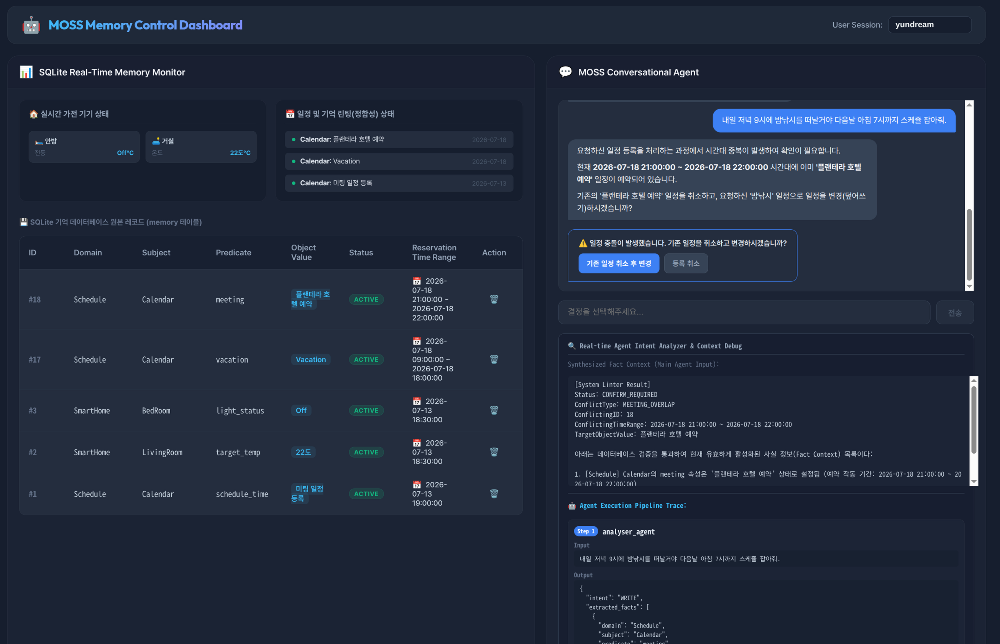

# MOSS (Memory Oriented Safety System)



MOSS는 인공지능 에이전트의 장기 기억 관리를 결정론적으로 통제하고 환각을 차단하여 안전한 일정 조작 및 기기 제어를 실현하기 위한 개념 검증용(PoC) 캘린더 에이전트 프로젝트입니다.

---

## 🚀 주요 특징

* **결정론적 메모리 Linter**: LLM의 확률적인 추론에 일정 예약을 맡기지 않고, 백엔드 Go 룰 엔진에서 물리적 시간대 중복 및 연차-회의 간 우선순위 충돌을 수학적으로 검사하고 차단합니다.
* **API & UI 상태 바인딩**: 비결정론적인 대화형 멀티턴 분기를 배제하고, 서버가 반환한 `ConfirmRequired` 메타데이터를 클라이언트(Svelte 5)가 바인딩하여 안전한 직접 UI 버튼 상호작용으로 예외를 처리합니다.
* **LLM 기억의 외부화**: 대화 이력 전체를 프롬프트에 누적하는 대신, 검증을 통과하여 DB에 적재된 유효 팩트(`active`)만 선별 주입하여 토큰 비용을 최소화하고 환각을 방지합니다.

---

## 🛠️ 기술 스택

* **Backend**: Go (v1.25+) 및 Gin Web Framework
* **Frontend**: Svelte 5 + Vite CSR (Nginx serving)
* **Agent Framework**: Google Go ADK (`github.com/google/adk`)의 Graph Workflow 런타임
* **Database**: modernc.org/sqlite (Pure Go SQLite 드라이버)
* **LLM Model**: Google AI Studio `gemini-3.5-flash`

---

## 📁 디렉토리 구조 요약

```text
poc/moss/
├── README.md             # 본 프로젝트 개요 문서
├── docker-compose.yml    # 전체 컨테이너 오케스트레이션
├── my-vertexai-key.json  # GCP 서비스 계정 키 파일 (배포 시 제외)
├── backend/
│   ├── main.go           # Gin Web API 서버 진입점
│   ├── database/         # SQLite DB 드라이버 및 repository
│   └── engine/           # Go ADK 기반 의도 분석, Linter, 프롬프트 합성 워크플로우
└── frontend/
    ├── src/              # Svelte 5 컴포넌트 (ChatBox, DbMonitor)
    └── nginx.conf        # Nginx 웹 서버 라우팅 설정
```

---

## ⚡ 퀵 스타트

### 1. 환경 설정 및 키 파일 준비
`poc/moss/backend/` 디렉토리에 `.env` 파일을 작성하고, 루트(`poc/moss/`) 디렉토리에 GCP 서비스 계정 키 파일을 배치합니다.

* **GCP 서비스 계정 키 파일**: `poc/moss/my-vertexai-key.json`
* **`.env` 파일 작성 (`poc/moss/backend/.env`)**:
  ```env
  GOOGLE_APPLICATION_CREDENTIALS=/app/my-vertexai-key.json
  GCP_PROJECT_ID=your-gcp-project-id
  GCP_LOCATION=us
  GEMINI_MODEL=gemini-3.5-flash
  ```
  > [!IMPORTANT]
  > 다운로드한 구글 서비스 계정에는 **`Agent Platform User`** (구 `Vertex AI User`) 혹은 **`Agent Platform Administrator`** 역할(Role)이 반드시 부여되어 있어야 합니다.

### 2. 컨테이너 빌드 및 구동
루트 디렉토리(`poc/moss/`)에서 도커 컴포즈 명령을 실행합니다.
```bash
docker compose up -d --build
```
* **Frontend 웹 화면**: `http://localhost:80`
* **Backend API 서버**: `http://localhost:8080`

---

## 🧪 API 검증 테스트 시나리오

### 웹 UI를 통한 시각적 검증 (권장)
웹 브라우저에서 `http://localhost:80`에 접속하여 메인 대화창과 실시간 DB 모니터링 화면을 통해 더욱 쉽고 직관적으로 검증할 수 있습니다.

* **1단계**: 대화창에 `"나 내일 금요일(7/17) 하루 종일 연차 휴가야. 캘린더에 등록해줘."`를 입력합니다. 좌측 모니터에 연차 일정(`Vacation - active`)이 갱신되는지 확인합니다.
* **2단계**: 대화창에 `"금요일 오전 10시에 개발팀 미팅 일정 예약해줘."`를 입력합니다. 시간 충돌 알림과 함께 입력이 일시 차단되며, `[휴가 중 회의 추가 등록]`, `[등록 취소]` 버튼이 화면에 나타나는지 확인합니다.
* **3단계**: 대화창에 `"금요일 오전 10시에 내 일정 요약해줘."`를 입력하여 우측의 단순 대화 누적(대조군) 결과와 MOSS 기억 제어(실험군) 결과의 일관성 및 토큰 절감률을 대조합니다.

### API 기반 검증 (Curl)
아래 Curl 명령어를 터미널에서 구동하여 동일한 시나리오 단계를 수동으로 검증할 수도 있습니다.

* **1단계: 최초 연차 등록 (WRITE)**
```bash
curl -s -X POST http://localhost:8080/api/chat \
  -H "Content-Type: application/json" \
  -d '{"user_name": "yundream", "text": "나 내일 금요일(7/17) 하루 종일 연차 휴가야. 캘린더에 등록해줘."}'
```

### 2단계: 연차와 겹치는 시간대 미팅 등록 시도 (WRITE / 충돌 감지)
Linter가 충돌을 식별하여 임시 보류 및 `confirm_required: true`를 피드백하는지 검증합니다.
```bash
curl -s -X POST http://localhost:8080/api/chat \
  -H "Content-Type: application/json" \
  -d '{"user_name": "yundream", "text": "금요일 오전 10시에 개발팀 미팅 일정 예약해줘."}'
```

### 3단계: 최종 일정 요약 질의 (QUERY)
대화 이력이 누적되어 꼬이지 않고, MOSS DB 팩트에만 기반하여 일관성 있게 일정을 안내하는지 검증합니다.
```bash
curl -s -X POST http://localhost:8080/api/chat \
  -H "Content-Type: application/json" \
  -d '{"user_name": "yundream", "text": "금요일 오전 10시에 내 일정 요약해줘."}'
```